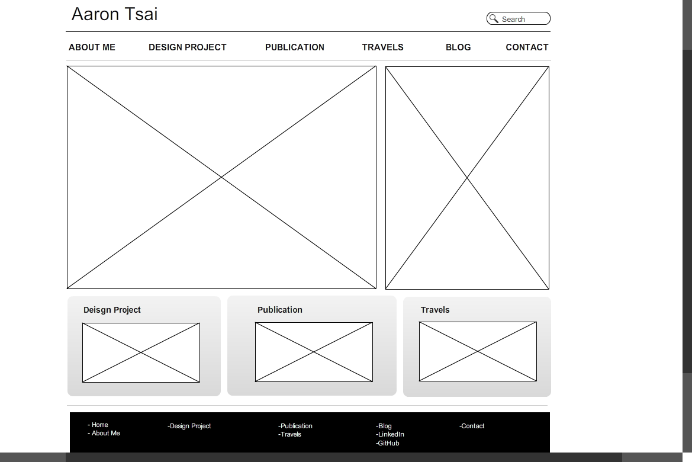

###What is a wireframe?
  Wireframe is the basic front-end structure of a webpage. It includes the general distribution of different elements on the page, including images, texts, and links.
###What are the benefits of wireframing?
  Wireframing allows a developer to get a rough visual idea of how the website will look like. It also allows the developer to think about what content, or rather, how much content can be shown on the page, and easily make adjustment to it.
###Did you enjoy wireframing your site?
  I did not really enjoy wireframing for my site because I wasn't sure exactly what I want to put on my website yet. It was interesting trying out different tools in creating a wireframe, although most of them eventually will cost money.
###Did you revise your wireframe or stick with your first idea?
  So far I have not make any modification on my wireframe since I just created. But I can see how I will go back and make adjustments or perhaps even drastic changes to it later on.
###What questions did you ask during this challenge? What resources did you find to help you answer them?
  I guess when I first started trying to create a wireframe on a blank page, I was a little lost on how to begin, although we should be used to seeing webpages all the time already. I went on google and looked for some wireframe templates for both websites and blogs and started from there.
###Which parts of the challenge did you enjoy and which parts did you find tedious?
  Finding the tools but have very limited functionalities, such as saving or creating multiple wireframes, without actually paying for them. But that allowed me to look for different tools and try out different ones.