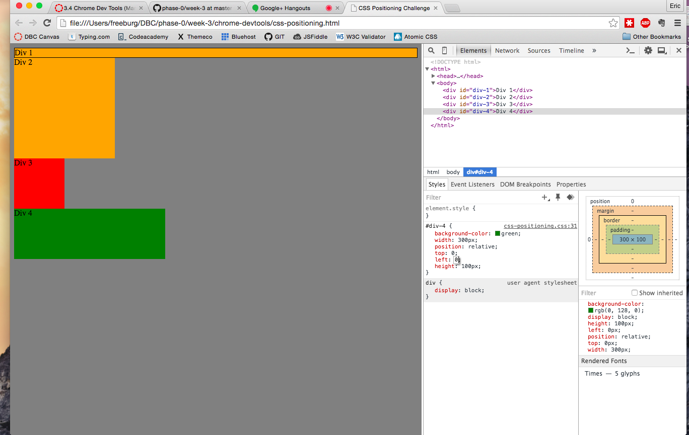
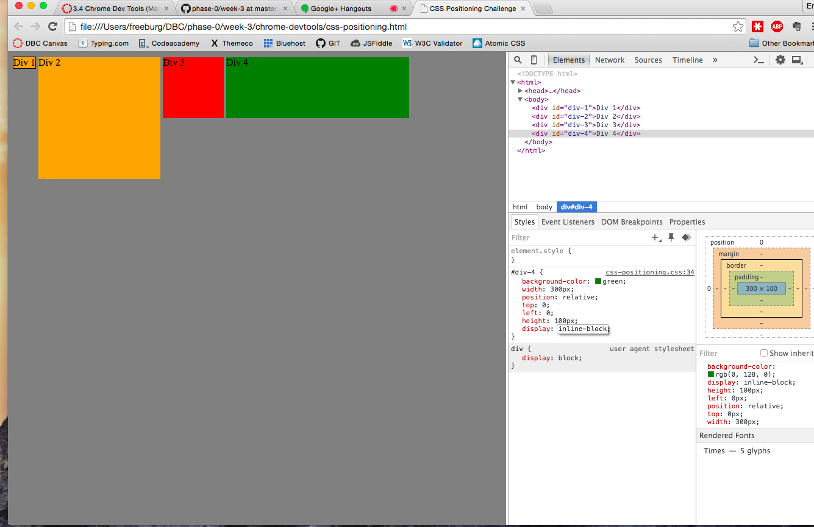
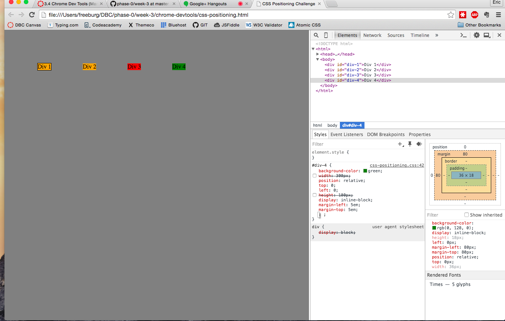
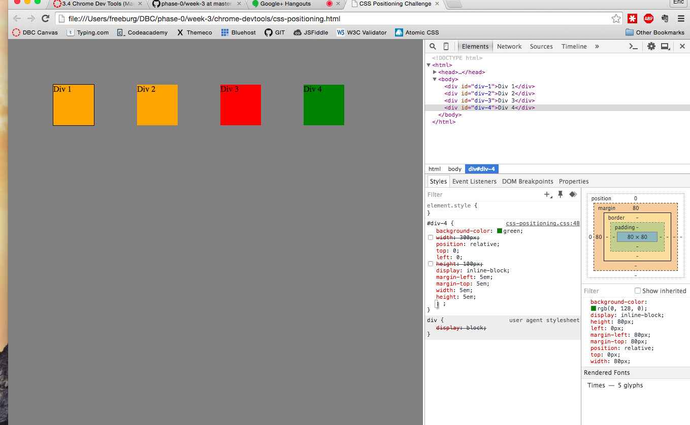
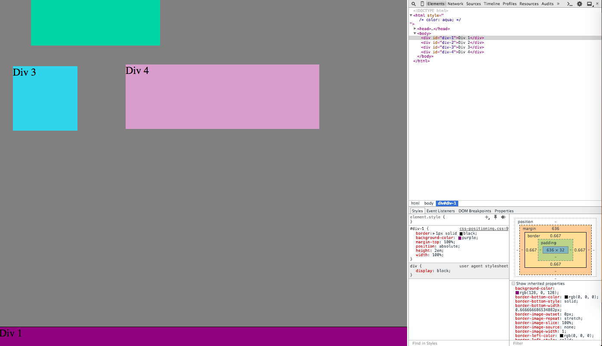
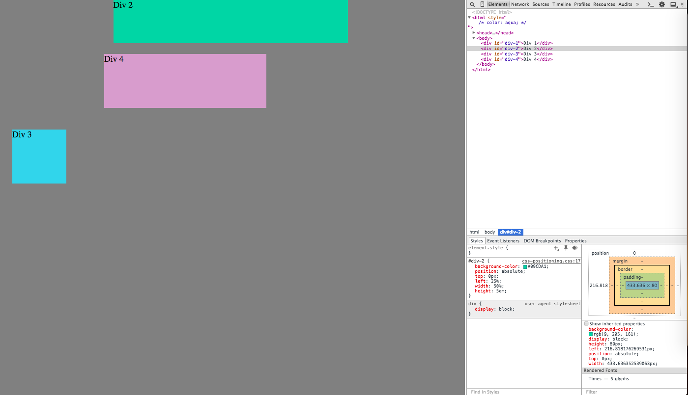
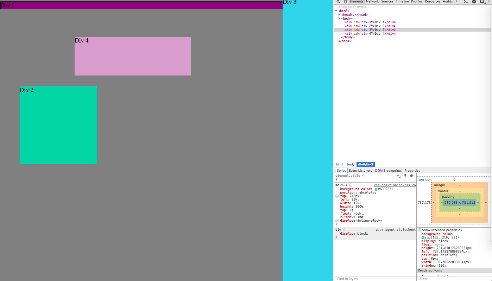
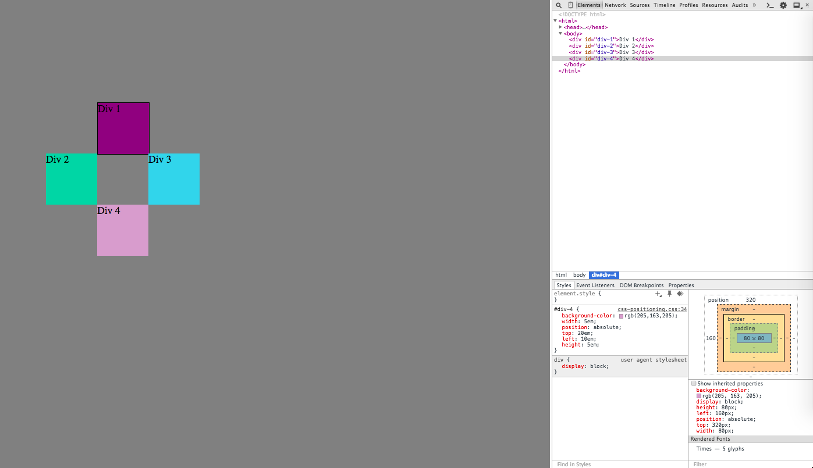

###How can you use Chrome's DevTools inspector to help you format or position elements?
  Like how we did in this assignment, Chrome's DevTools inspector gives a clear visualized analysis for your elements. It is much easier in positioning different elements than looking at just the code from CSS or HTML.
###How can you resize elements on the DOM using CSS?
  You can change the size of elements by changing the height and width dimention of them.
###What are the differences between Absolute, Fixed, Static, and Relative positioning? Which did you find easiest to use? Which was most difficult?
  Static positioning display elements as part of normal HTML flow; relative positioning display element with a specific offset in relative to the normal position in HTML; absolute positioning display element at the exact location where it is specified to the entire document; fixed positioning restricts an element at the specified location, and stays in place during scroll. I found absolute to be easiest to use and relative to be most difficult to use.
###What are the differences between Margin, Border, and Padding?
  Border separates margin and padding in a way that margin is the space outside of the border whereas padding is the space between the border and the actual content.
###What was your impression of this challenge overall? (love, hate, and why?)
  I really enjoyed this challenge because the Devtool inspector allows us to observe visually on the changes made. Therefore I was able to have a lot of confusion clarified by playing around with the devtool and through trial and error.