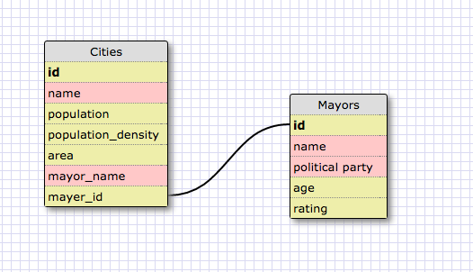
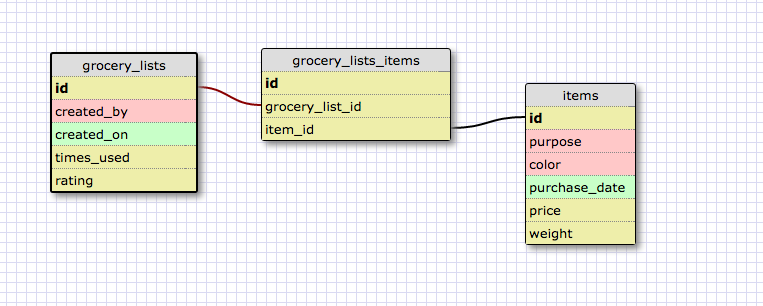

## One-to-one Schema

## Many-to-many Schema

##Reflection

####What is a one-to-one database?
  One-to-one database is when you have two things that have a single forward relationship to one another.
####When would you use a one-to-one database? (Think generally, not in terms of the example you created).
  When one entity is represented uniquely at another entity.

####What is a many-to-many database?
  A relationship type between two entities in which each contain multiple parents/children records.
####When would you use a many-to-many database? (Think generally, not in terms of the example you created).
  When an entity is created by multiple entities while the parent entities can also create multiple child entities.
####What is confusing about database schemas? What makes sense?
  It makes sense. But it is very difficult to put them in conceptual words and describe them.